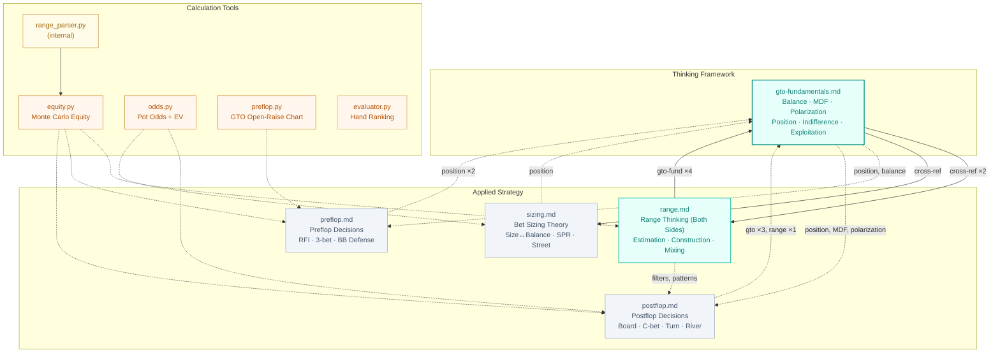

# Poker Agent

GTO calculation tools + strategy knowledge base — powers CoachBot coaching and play bot decisions.

> Visual version with interactive mind map: [README.html](./README.html)

## Knowledge Architecture

## Three-Layer Design

| Layer | Role | Contents |
|-------|------|----------|
| **Thinking Framework** | GTO reasoning — teach how to think, not list rules | `gto-fundamentals.md` (300 lines) |
| **Applied Strategy** | Scenario-specific decision reasoning | `range.md` (340) · `preflop.md` (117) · `postflop.md` (123) · `sizing.md` (145) |
| **Calculation Tools** | Numeric verification, think-then-calculate | `equity.py` · `odds.py` · `preflop.py` · `evaluator.py` · `range_parser.py` |

## Strategy Documents

**gto-fundamentals.md** — GTO thinking framework. Logic of balance, MDF derivation, polarization progression, underlying principles of position (information advantage, equity realization, pot control), indifference principle, risk-reward tradeoffs of exploitation. Referenced by all other docs.

**range.md** — Two-way range reasoning. Estimate villain's range while staying aware of how your own range looks from their perspective. Preflop starting point → postflop triple filter (bet/call/check) → mixed strategy execution → opponent profiling. References gto-fundamentals 4 times — the bridge between thinking and application layers.

**preflop.md** — Preflop decisions. Why play this hand (equity × playability × position), logical derivation of RFI/3-bet/4-bet/BB defense scenarios.

**postflop.md** — Postflop decisions. Thinking loop: villain range → position → structural advantage → math verification. Board texture, c-bet, double barrel, river play, OOP as BB defender.

**sizing.md** — Bet sizing. Size↔balance relationship, SPR commitment, street-by-street sizing planning. Closest to reference-manual style.

## Tools

| Tool | Purpose | Usage |
|------|---------|-------|
| `equity.py` | Monte Carlo equity (hero vs range) | `equity.py Ah Kh "QQ+,AKs" Td 7d 2c --sims 10000` |
| `odds.py` | Pot odds, EV, MDF, implied odds | `odds.py 200 50 0.35 --implied 300` |
| `preflop.py` | GTO open-raise frequency (6-max, 100BB) | `preflop.py Ah Ks CO` |
| `evaluator.py` | Hand ranking (5-7 cards) | `evaluator.py Ah Kh Qh Jh Th` |
| `range_parser.py` | Range notation → combo list (internal) | Used by equity.py |

All tools: `python3 poker-strategy/tools/<tool>.py`. Card notation: ranks `2-9 T J Q K A`, suits `h d c s`.

## Cross-Reference Matrix

| ↓ references → | gto-fund. | range | preflop | postflop | sizing |
|----------------|-----------|-------|---------|----------|--------|
| **gto-fundamentals** | — | ✓✓ | | | ✓ |
| **range** | ✓✓✓✓ | — | | | ✓ |
| **preflop** | ✓✓ | | — | | |
| **postflop** | ✓✓✓ | ✓ | | — | |
| **sizing** | ✓ | | | | — |

## Consumers

| Consumer | What it reads | How |
|----------|--------------|-----|
| **CoachBot** | All 5 strategy docs + SKILL.md | Loaded into context at session start |
| **BotManager** | Strategy docs per bot skill level | Inlined into subagent prompts (no file paths) |
| **Play Bots** | Nothing directly | All knowledge comes via BotManager prompt |

## Design Principles

**Teach How to Think, Not Rules** — Every document explains "why" rather than listing "what to do." Tables are embedded in explanatory context; the goal is for the reader to learn the reasoning process.

**Three-Layer Architecture** — Thinking → Application → Tools. Each layer can be used independently, but they're strongest combined.

**Cross-Reference, Not Duplication** — Each concept is explained deeply in exactly one place; other docs cross-reference it. For example, the full theory of position lives in gto-fundamentals; preflop/postflop/sizing reference it without repeating.
