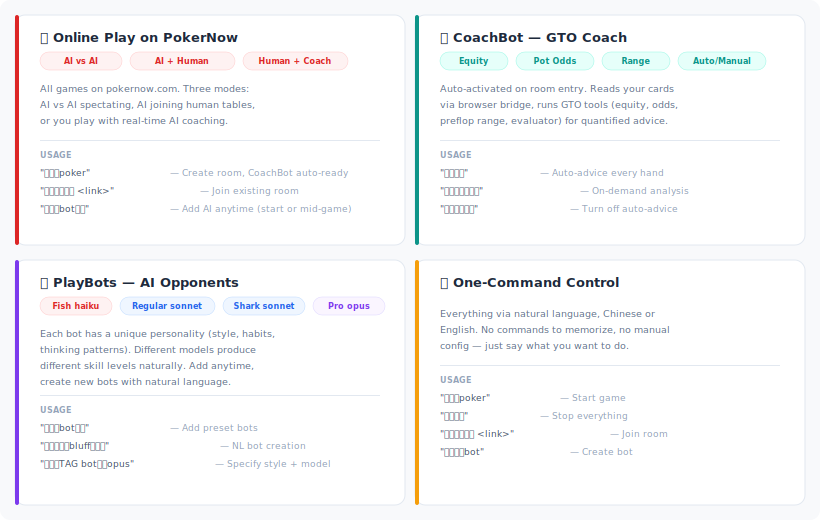
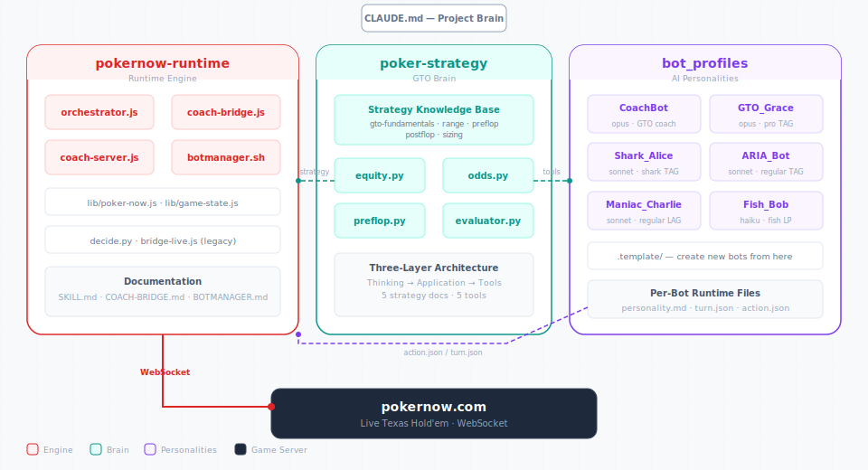
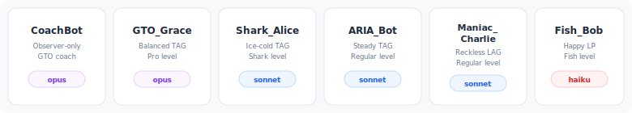
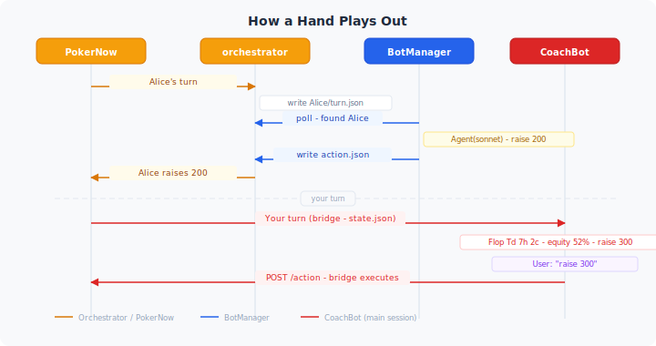
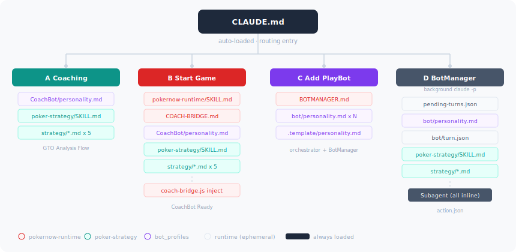

# PokerBot

Multi-agent poker system — AI bots with distinct personalities play Texas Hold'em, powered by Claude Code. Self-hosted game server (primary) with pokernow.com fallback.

`Self-Hosted` · `WebSocket` · `Multi-Agent` · `GTO Tools` · `Dual-Session` · `Live Coaching`

---

## Quick Start

**Prerequisites**: Claude Code (CLI, desktop, or IDE) · Node.js 18+ · Python 3.10+

```bash
cd PokerBot/poker-server && npm install    # Primary: self-hosted server
cd PokerBot/pokernow-runtime && npm install    # Fallback: pokernow.com connector
```

Open Claude Code in `PokerBot/` and say:

> "play poker" — start self-hosted server, open localhost:3457 in browser
>
> "join pokernow.com/games/pglXXXXXX" — join an existing pokernow room (fallback)
>
> "add bots" — add AI players to the table (at start or mid-game)
>
> "create a new bot, aggressive old man who loves to bluff" — build bots with natural language
>
> "public game" — localtunnel for remote access
>
> "stop game" — shut everything down

## Features



## Architecture



## Four Subsystems

**poker-server/ — PRIMARY Game Backend**: Self-hosted Texas Hold'em server. HTTP + WebSocket on port 3457, browser UI for human players, `/state` and `/action` API for CC. Optional `--public` flag for localtunnel access. No browser extensions needed.

**pokernow-runtime/ — FALLBACK Engine**: WebSocket connections to pokernow.com, dual-session architecture (Main Session + BotManager), orchestrator for multi-bot management. Only used when joining someone else's pokernow.com room.

**poker-strategy/ — GTO Brain**: GTO knowledge + calculation tools. Five strategy documents (teach thinking, not rules), five Python tools (equity, odds, preflop, evaluator, range parser). Three-layer architecture: Thinking → Application → Tools. 5 strategy docs (1,025 lines) · 5 tools (1,343 lines).

**bot-management/bots/ — AI Personalities**: Each bot has identity (name, model, style), habits (tendencies, tells), and workflow (how they think through decisions). Ranges from fish (haiku, no tools) to pro (opus, full GTO toolkit). 6 bots + template · personality.md per bot.

## Bot Roster



Create new bots with natural language: "create a TAG-style bot using opus model". Each bot lives in `bot-management/bots/{name}/personality.md`. Copy from `.template/` to create new bots.

## Dual-Session Architecture

**Main Session = CoachBot**: Always responsive. User chats freely, gets GTO advice, confirms actions. Reads game state via poker-server API (`/state`), sends actions via `/action`. Never blocked by bot decisions.

**Background = BotManager**: Invisible to user. `bot-management/botmanager.sh` polls for pending turns every 2s. Each batch spawns a fresh `claude -p` session that creates parallel subagents (one per bot). Writes action.json, exits.

**Orchestrator = Bridge**: Connects all bots to PokerNow via WebSocket. Routes turns (writes pending-turns.json + turn.json), reads actions (polls action.json), executes moves. Auto check/fold after 60s.

## How a Hand Plays Out



## Information Isolation

Three layers ensure no bot cheats:

**Layer 1 — Data**: Orchestrator only puts each bot's own hole cards in their turn.json. No cross-bot data at the WebSocket level. Enforced by: orchestrator.js.

**Layer 2 — Prompt**: BotManager inlines all data as plain text. Subagent prompts contain NO file paths, NO directory names, NO other bot names. Zero filesystem knowledge. Strategy docs inlined (not Read) by skill level. Enforced by: bot-management/botmanager-init.md + bot-management/botmanager-turn.md.

**Layer 3 — Session**: CoachBot runs in main session (sees user's cards via bridge). Bot decisions run in separate `claude -p` sessions. User's cards never enter any bot's prompt. Enforced by: dual-session architecture.

## Project Structure

```
PokerBot/
  CLAUDE.md                 Project brain: rules, activation triggers, architecture
  README.md                 This file (Markdown version with Mermaid)
  game.json                 Active game config (ephemeral, delete = stop)

  poker-server/             PRIMARY game backend (self-hosted)
    poker-server.js         HTTP + WebSocket server (:3457)
    lib/poker-engine.js     Pure game engine (deal, bet, showdown)
    public/poker-table.html Browser UI (join, play, spectate)

  pokernow-runtime/         FALLBACK engine (pokernow.com)
    scripts/
      orchestrator.js       Multi-bot WebSocket manager
      coach-ws.js           CoachBot WebSocket bridge
      decide.py             CLI action validator
    lib/
      poker-now.js          WebSocket client
      game-state.js         State parser
    SKILL.md                Fallback game flow

  poker-strategy/           GTO brain
    strategy/
      gto-fundamentals.md   Thinking framework (300 lines)
      range.md              Range thinking both sides (340 lines)
      preflop.md            Preflop decisions (117 lines)
      postflop.md           Postflop decisions (123 lines)
      sizing.md             Bet sizing theory (145 lines)
    tools/
      equity.py / odds.py / preflop.py / evaluator.py
      range_parser.py       Internal
    SKILL.md                Tool manual

  bot-management/           AI bot management + personalities
    botmanager.sh           Background bot decision loop
    botmanager-init.md      Init prompt: load personality + strategy
    botmanager-turn.md      Turn prompt: read state, decide, act, EXIT
    BOTMANAGER.md           BotManager architecture & isolation rules
    bots/
      .template/            Copy to create new bot
      GTO_Grace/            Balanced pro (opus)
      Shark_Alice/          Ice-cold shark (sonnet)
      ARIA_Bot/             Steady regular (sonnet)
      Maniac_Charlie/       Reckless LAG (sonnet)
      Fish_Bob/             Happy fish (haiku)

  bot_profiles/             Player data (user sessions, CoachBot)
    <UserName>/             User play sessions + history
    CoachBot/               CoachBot personality (modes.md, personality.md)
```

## Document Loading Chain

`CLAUDE.md` is always loaded (session auto-load). It routes to different document sets depending on the scenario:



| Scenario | Trigger | Key docs loaded |
|---|---|---|
| A: Pure Coaching | "how to play AK" / "should I call" | personality.md + SKILL.md + strategy × 5 |
| B: Start Game (self-hosted) | "play poker" | poker-server docs + (A files) |
| B': Start Game (pokernow) | "join pokernow room" | pokernow-runtime/SKILL.md + (A files) |
| C: Add PlayBots | "add bots" / "let AI play too" | BOTMANAGER.md + bot personality × N |
| D: BotManager | botmanager.sh auto · every 2s | pending-turns.json + personality + turn.json + strategy (inline) |

**Authoritative file list**: `CLAUDE.md` → CoachBot Activation section.

---

PokerBot · 4 subsystems · 6 bots · 5 strategy docs · 5 tools · self-hosted server
