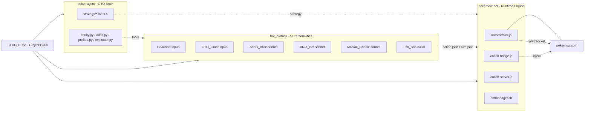
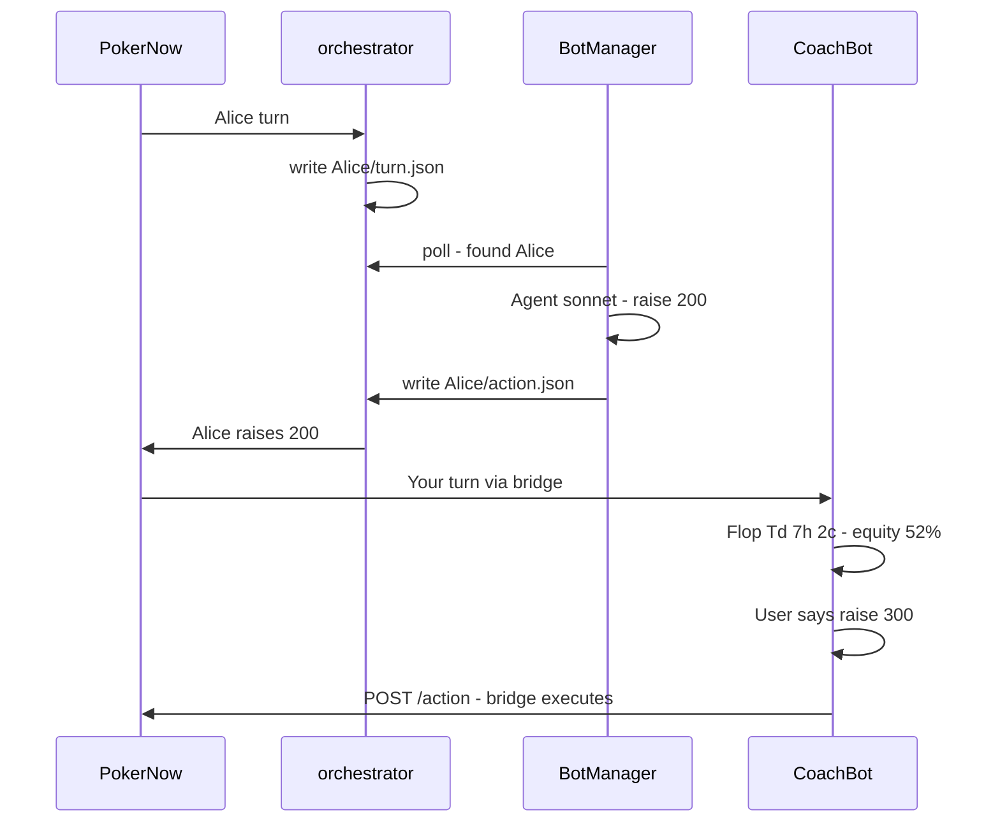
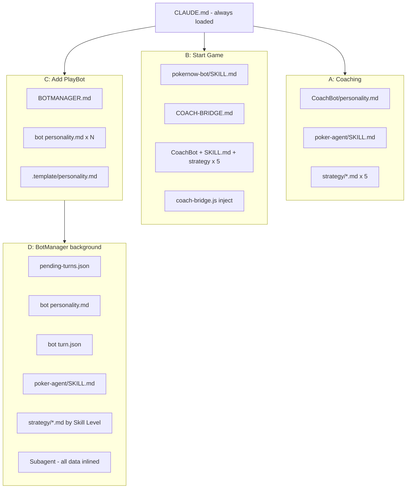

# PokerBot

Multi-agent poker system — AI bots with distinct personalities play Texas Hold'em live on pokernow.com, powered by Claude Code.

`WebSocket` · `Multi-Agent` · `GTO Tools` · `Dual-Session` · `Live Coaching`

---

## Quick Start

**Prerequisites**: Claude Code (CLI, desktop, or IDE) · Node.js 18+ · Python 3.10+

```bash
cd PokerBot/pokernow-bot && npm install && cp .env.example .env
```

Open Claude Code in `PokerBot/` and say:

> "来一局poker" — 创建房间，CoachBot 自动就绪
>
> "加入这个房间 https://www.pokernow.com/games/pglXXXXXX" — 加入已有房间
>
> "加几个bot进来" — 随时加AI上桌（开局或中途）
>
> "加一个新bot，性格是喜欢bluff的老头" — 自然语言建bot
>
> "结束游戏" — 停止一切

## Features

### 🌐 在线对战平台 — Online Play on PokerNow

`🤖 AI vs AI — 纯AI互打` · `🤖+👤 AI加入真人房间` · `👤+🧠 人类+AI Coaching`

所有对局在 pokernow.com 线上进行，支持三种玩法：AI之间互相对战观赏、AI加入真人牌桌混战、或你亲自上阵并获得AI实时辅助。进入房间即自动激活 CoachBot，随时可用。

### 🧠 CoachBot — GTO 实时教练

`📊 Equity计算` · `📐 Pot Odds` · `🎯 Range分析` · `💡 自动/按需两种模式`

进入房间即自动激活。CoachBot 通过浏览器桥接实时读取你的牌面，调用 GTO 工具（equity、odds、preflop range、hand evaluator）给出量化建议。自动模式每手都分析，按需模式你问才答。

> "帮我盯着" — 开启自动建议 · "这手牌怎么打？" — 按需分析 · "别给我建议了" — 关掉自动 · "这手牌我打得对吗？" — 复盘

### 🎭 多层次 PlayBot — AI 陪玩对手

`Fish 🐟 haiku` · `Regular 🃏 sonnet` · `Shark 🦈 sonnet` · `Pro 👑 opus`

随时可加的AI对手。每个 PlayBot 有独立人格（风格、习惯、思考方式），不同模型天然产生不同水平：haiku 做鱼、sonnet 做常客/鲨鱼、opus 做职业选手。开局或中途均可添加，用自然语言创建新bot。

> "加几个bot进来" — 添加预设bot · "加一个新bot，性格是喜欢bluff的老头" — 自然语言建bot · "建一个TAG风格的bot，用opus模型" — 指定风格+模型

### 💬 一句话操控 — One-Command Control

所有操作都通过自然语言完成，中英文均可。无需记命令、无需手动配置——直接说你想做什么。

> "来一局poker" — 开始游戏 · "结束游戏" — 停止一切 · "加入这个房间 \<link\>" — 加入房间 · "加一个新bot" — 创建bot

## Architecture



## Three Subsystems

**pokernow-bot/ — Runtime Engine**: WebSocket connections to pokernow.com, dual-session architecture (Main Session + BotManager), browser bridge for CoachBot, orchestrator for multi-bot management. Everything that makes the system run. 8 scripts · 2 libs · 3 docs.

**poker-agent/ — GTO Brain**: GTO knowledge + calculation tools. Five strategy documents (teach thinking, not rules), five Python tools (equity, odds, preflop, evaluator, range parser). Three-layer architecture: Thinking → Application → Tools. 5 strategy docs (1,025 lines) · 5 tools (1,343 lines).

**bot_profiles/ — AI Personalities**: Each bot has identity (name, model, style), habits (tendencies, tells), and workflow (how they think through decisions). Ranges from fish (haiku, no tools) to pro (opus, full GTO toolkit). 6 bots + template · personality.md per bot.

## Bot Roster

| Bot | Style | Level | Model |
|-----|-------|-------|-------|
| CoachBot | Observer-only GTO coach | — | opus |
| GTO_Grace | Balanced TAG | Pro | opus |
| Shark_Alice | Ice-cold TAG | Shark | sonnet |
| ARIA_Bot | Steady TAG | Regular | sonnet |
| Maniac_Charlie | Reckless LAG | Regular | sonnet |
| Fish_Bob | Happy-go-lucky LP | Fish | haiku |

Create a new bot with natural language: "建一个TAG风格的bot，用opus模型"

Each bot lives in `bot_profiles/{name}/personality.md` with Identity, Character, Habits, and Workflow sections. Copy from `.template/` to create new bots.

## Dual-Session Architecture

**Main Session = CoachBot**: Always responsive. User chats freely, gets GTO advice, confirms actions. Reads game state via coach-server (HTTP), sends actions via curl. Never blocked by bot decisions.

**Background = BotManager**: Invisible to user. `botmanager.sh` polls for pending turns every 2s. Each batch spawns a fresh `claude -p` session that creates parallel subagents (one per bot). Writes action.json, exits.

**Orchestrator = Bridge**: Connects all bots to PokerNow via WebSocket. Routes turns (writes pending-turns.json + turn.json), reads actions (polls action.json), executes moves. Auto check/fold after 60s.

## How a Hand Plays Out



## Information Isolation

Three layers ensure no bot cheats:

**Layer 1 — Data**: Orchestrator only puts each bot's own hole cards in their turn.json. No cross-bot data at the WebSocket level. Enforced by: orchestrator.js.

**Layer 2 — Prompt**: BotManager inlines all data as plain text. Subagent prompts contain NO file paths, NO directory names, NO other bot names. Zero filesystem knowledge. Strategy docs inlined (not Read) by skill level. Enforced by: botmanager-prompt.md.

**Layer 3 — Session**: CoachBot runs in main session (sees user's cards via bridge). Bot decisions run in separate `claude -p` sessions. User's cards never enter any bot's prompt. Enforced by: dual-session architecture.

## Project Structure

```
PokerBot/
  CLAUDE.md                 Project brain: rules, activation triggers, architecture
  README.md                 This file (Markdown version with Mermaid)
  game.json                 Active game config (ephemeral, delete = stop)

  pokernow-bot/             Runtime engine
    scripts/
      orchestrator.js       Multi-bot WebSocket manager
      coach-bridge.js       Browser-injected CoachBot bridge
      coach-server.js       HTTP bridge server (:3456)
      botmanager.sh         Background bot decision loop
      decide.py             CLI action validator
    lib/
      poker-now.js          WebSocket client
      game-state.js         State parser
    SKILL.md                Game flow (Enter Room, Add Bots, Stop)
    COACH-BRIDGE.md         Bridge connection & API reference
    BOTMANAGER.md           BotManager prompt, isolation rules

  poker-agent/              GTO brain
    strategy/
      gto-fundamentals.md   Thinking framework (300 lines)
      range.md              Range thinking both sides (340 lines)
      preflop.md            Preflop decisions (117 lines)
      postflop.md           Postflop decisions (123 lines)
      sizing.md             Bet sizing theory (145 lines)
    tools/
      equity.py / odds.py / preflop.py / evaluator.py
      range_parser.py       Internal
    SKILL.md                Tool manual

  bot_profiles/             AI personalities
    .template/              Copy to create new bot
    CoachBot/               Observer GTO coach (opus)
    GTO_Grace/              Balanced pro (opus)
    Shark_Alice/            Ice-cold shark (sonnet)
    ARIA_Bot/               Steady regular (sonnet)
    Maniac_Charlie/         Reckless LAG (sonnet)
    Fish_Bob/               Happy fish (haiku)
```

## Document Loading Chain

`CLAUDE.md` is always loaded (session auto-load). It routes to different document sets depending on the scenario:



| Scenario | Trigger | Key docs loaded |
|---|---|---|
| A: 纯 Coaching | "AK怎么打" / "该不该call" | personality.md + SKILL.md + strategy × 5 |
| B: 开游戏 | "来一局poker" / "加入房间" | pokernow-bot/SKILL.md + COACH-BRIDGE.md + (A files) |
| C: 加 PlayBot | "加几个bot" / "让AI也来打" | BOTMANAGER.md + bot personality × N |
| D: BotManager | botmanager.sh 自动 · 每2s | pending-turns.json + personality + turn.json + strategy (inline) |

**Authoritative file list**: `CLAUDE.md` → CoachBot Activation section.

---

PokerBot · 3 subsystems · 6 bots · 5 strategy docs · 5 tools · 8 runtime scripts
