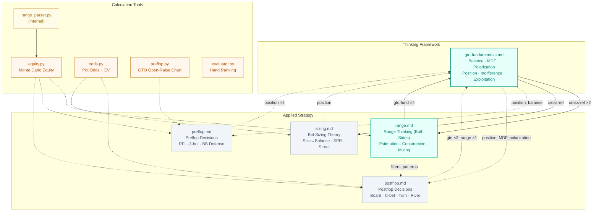

# Poker Agent

GTO calculation tools + strategy knowledge base — powers CoachBot coaching and play bot decisions.

> Visual version with interactive mind map: [README.html](./README.html)

## Knowledge Architecture

## Three-Layer Design

| Layer | Role | Contents |
|-------|------|----------|
| **Thinking Framework** | GTO思维方式——教怎么想，不是列规则 | `gto-fundamentals.md` (300 lines) |
| **Applied Strategy** | 具体场景的决策推理 | `range.md` (340) · `preflop.md` (117) · `postflop.md` (123) · `sizing.md` (145) |
| **Calculation Tools** | 数字验证，边想边算 | `equity.py` · `odds.py` · `preflop.py` · `evaluator.py` · `range_parser.py` |

## Strategy Documents

**gto-fundamentals.md** — GTO思维框架。Balance的逻辑、MDF的推导、Polarization的演进、Position的底层原理（信息优势、equity realization、pot control）、Indifference principle、Exploitation的风险收益权衡。被所有其他文档引用。

**range.md** — 双向range推演。估计对手range的同时，意识到自己的range在对手眼里是什么。Preflop起点 → postflop三重过滤器（bet/call/check） → 混合策略执行 → opponent profiling。引用gto-fundamentals 4次，是thinking和application之间的桥梁。

**preflop.md** — 翻前决策。为什么打这手牌（equity × playability × position），RFI/3-bet/4-bet/BB defense各场景的逻辑推导。

**postflop.md** — 翻后决策。Thinking loop: villain range → position → structural advantage → math verification。Board texture、c-bet、double barrel、river play、OOP as BB defender。

**sizing.md** — 下注尺寸。Size↔balance关系、SPR commitment、street-by-street sizing规划。最接近参考手册风格。

## Tools

| Tool | Purpose | Usage |
|------|---------|-------|
| `equity.py` | Monte Carlo equity (hero vs range) | `equity.py Ah Kh "QQ+,AKs" Td 7d 2c --sims 10000` |
| `odds.py` | Pot odds, EV, MDF, implied odds | `odds.py 200 50 0.35 --implied 300` |
| `preflop.py` | GTO open-raise frequency (6-max, 100BB) | `preflop.py Ah Ks CO` |
| `evaluator.py` | Hand ranking (5-7 cards) | `evaluator.py Ah Kh Qh Jh Th` |
| `range_parser.py` | Range notation → combo list (internal) | Used by equity.py |

All tools: `python3 poker-agent/tools/<tool>.py`. Card notation: ranks `2-9 T J Q K A`, suits `h d c s`.

## Cross-Reference Matrix

| ↓ references → | gto-fund. | range | preflop | postflop | sizing |
|----------------|-----------|-------|---------|----------|--------|
| **gto-fundamentals** | — | ✓✓ | | | ✓ |
| **range** | ✓✓✓✓ | — | | | ✓ |
| **preflop** | ✓✓ | | — | | |
| **postflop** | ✓✓✓ | ✓ | | — | |
| **sizing** | ✓ | | | | — |

## Consumers

| Consumer | What it reads | How |
|----------|--------------|-----|
| **CoachBot** | All 5 strategy docs + SKILL.md | Loaded into context at session start |
| **BotManager** | Strategy docs per bot skill level | Inlined into subagent prompts (no file paths) |
| **Play Bots** | Nothing directly | All knowledge comes via BotManager prompt |

## Design Principles

**Teach How to Think, Not Rules** — 所有文档解释"为什么"而不是列"做什么"。表格嵌入解释性上下文中，目标是让读者学会推理过程。

**Three-Layer Architecture** — Thinking → Application → Tools。每一层都能独立使用，但组合起来最强。

**Cross-Reference, Not Duplication** — 概念只在一个地方深入解释，其他地方通过cross-reference指向它。例如position的完整理论在gto-fundamentals，preflop/postflop/sizing只引用不重复。
